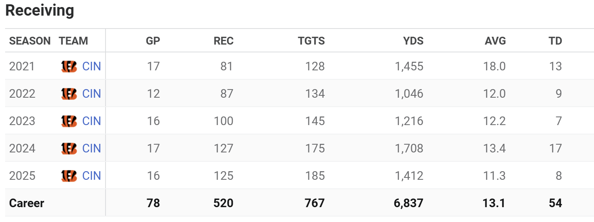
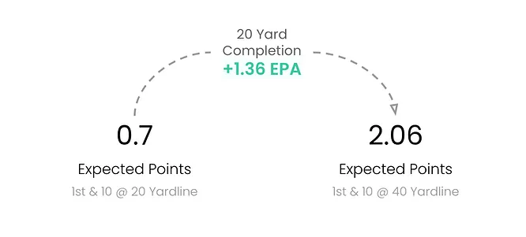

## Outline

+ [Selecting a Quarterback Prospect](#warm-up)
+ [The Most Productive Receivers](#the-most-productive-receivers)
+ [To go for it on 4th Down?](#to-go-for-it-on-4th-down)
+ [Fastest 40 Yard Dash Times](#fastest-40-times)
+ [Red Zone Target](#red-zone-target)
+ [The Optimal Quarterback](#the-optimal-quarterback)

## Warm Up

Our team has the first overall pick in this year's draft, and we need a Quarterback. Which prospect should we select?

<details closed>
<summary>What are some variables that could be helpful in evaluating a College Quarterback?</summary>
+ Level of Competition (team and conference)
+ College Statistics
+ Combine Metrics (e.g. 40 yd dash time)
+ Height, Hand Size
</details>

::: {.content-visible when-format="revealjs"}
## Prospect A
:::
```{r}
# packages for pizza charts
library(tidyverse)
library(nflverse)
library(ggplot2)
library(gridExtra)
library(ggimage)
```

```{r}
# data retrieved using cfbfastR package + API key
career_stats <- read.csv('../data/qb_college_career_stats.csv')
career_stats <- career_stats %>% rename("completion %" = completion_percentage,
                                        "td-int ratio" = td_int_ratio,
                                        "total snaps" = total_offensive_plays
                                        )

# function for creating pizza plots
make_pizza <- function(player_name, alias = NA) {
  
  cols <- c("passing_tds", "td-int ratio",
          "rush_yards_per_game", "rushing_tds",
          "total snaps", "games_played",
          "yards_per_attempt", "completion %")
  
  specific_player <- player_name
  player_index <- which(career_stats$full_name == specific_player)
  player_start <- length(cols)*(player_index-1) + 1
  player_end <- length(cols)*player_index
  team_logo <- career_stats$logo_href[player_index]
  
  pizza_df <- career_stats %>%
  reframe(across(all_of(cols), ~ cume_dist(.x) * 100)) %>%
  pivot_longer(everything(), names_to = "category", values_to = "value")
  
  pizza_df <- pizza_df[player_start:player_end,] %>%
  mutate(
    id = row_number(),
    n = n(),
    angle = 360 * ((9-id) - 0.5) / n,
    angle_text = ifelse(90 < angle & angle < 270, angle + 180, angle),
    slice_color = case_when(
      value <= 33 ~ "red",
      value < 67 ~ "yellow",
      TRUE        ~ "green"
    )
  )
  
  rings <- c(10, 35, 60, 85, 110)
  
  if (is.character(alias)) {
    ggplot(pizza_df, aes(x = id, y = value + 10, fill = slice_color)) +
      geom_col(aes(y = 110), fill = "gray90", width = 1, color = "black") +
      geom_col(width = 1, color = "black", alpha = 0.9) +
      geom_col(aes(y = 10), fill = "gray90", width = 1) +
      geom_hline(
        yintercept = rings[2:4],
        color = "black",
        linewidth = 0.5,
        alpha = 0.5,
        linetype = 'dashed'
      ) +
      geom_hline(
        yintercept = rings[c(1,5)],
        color = "black",
        linewidth = 0.5,
      ) +
      coord_polar(start = 0) +
      scale_y_continuous(limits = c(0, 120)) +
      scale_fill_manual(
        values = c(
          "red" = "#d73027",
          "yellow" = "#fee08b",
          "green" = "#1a9850"
        ),
        labels = c("0-33", "33-67", "67-100"),
        breaks = c("red", "yellow", "green")
      ) +
      theme_void() +
      theme(
        plot.background = element_rect(fill = "#999999", color = NA),
        legend.position = "top",
        legend.margin = margin(t = 10),
        plot.title = element_text(hjust = 0.5, size = 18, face = "bold"),
        plot.subtitle = element_text(hjust = 0.5, size = 12)
      ) +
      labs(title = alias,
           subtitle = "Percentiles Compared with First Round QBs from 2015-2025",
           fill = '') +
      geom_text(
        data = pizza_df,
        aes(x = id, y = 120,
            label = str_to_title(gsub('_', ' ', category)),
            angle = angle_text
            ),
        size = 4,
        fontface = 'bold',
        color = "gray90"
        ) +
      geom_text(
        data = filter(pizza_df, value > 67),
        aes(x = id, y = value,
            label = round(value),
            angle = angle_text
            ),
        size = 4,
        fontface = 'bold',
        color = "gray90"
        ) +
      geom_text(
        data = filter(pizza_df, value <= 67),
        aes(x = id, y = value + 20,
            label = round(value),
            angle = angle_text
            ),
        size = 4,
        fontface = 'bold',
        color = "black"
        )
  }
  else {
    ggplot(pizza_df, aes(x = id, y = value + 10, fill = slice_color)) +
      geom_col(aes(y = 110), fill = "gray90", width = 1, color = "black") +
      geom_col(width = 1, color = "black", alpha = 0.9) +
      geom_col(aes(y = 10), fill = "gray90", width = 1) +
      geom_hline(
        yintercept = rings[2:4],
        color = "black",
        linewidth = 0.5,
        alpha = 0.5,
        linetype = 'dashed'
      ) +
      geom_hline(
        yintercept = rings[c(1,5)],
        color = "black",
        linewidth = 0.5,
      ) +
      coord_polar(start = 0) +
      scale_y_continuous(limits = c(0, 120)) +
      scale_fill_manual(
        values = c(
          "red" = "#d73027",
          "yellow" = "#fee08b",
          "green" = "#1a9850"
        ),
        labels = c("0-33", "33-67", "67-100"),
        breaks = c("red", "yellow", "green")
      ) +
      theme_void() +
      theme(
        plot.background = element_rect(fill = "#999999", color = NA),
        legend.position = "top",
        legend.margin = margin(t = 10),
        plot.title = element_text(hjust = 0.5, size = 18, face = "bold"),
        plot.subtitle = element_text(hjust = 0.5, size = 12)
      ) +
      labs(title = paste(specific_player, "College Profile", sep = " "),
           subtitle = "Percentiles Compared with First Round QBs from 2015-2025",
           fill = '') +
      geom_text(
        data = pizza_df,
        aes(x = id, y = 120,
            label = str_to_title(gsub('_', ' ', category)),
            angle = angle_text
            ),
        size = 4,
        fontface = 'bold',
        color = "gray90"
        ) +
      geom_text(
        data = filter(pizza_df, value > 67),
        aes(x = id, y = value,
            label = round(value),
            angle = angle_text
            ),
        size = 4,
        fontface = 'bold',
        color = "gray90"
        ) +
      geom_text(
        data = filter(pizza_df, value <= 67),
        aes(x = id, y = value + 20,
            label = round(value),
            angle = angle_text
            ),
        size = 4,
        fontface = 'bold',
        color = "black"
        ) +
  geom_image(data = data.frame(x = 0.5, y = 0, img = team_logo),
             aes(x = x, y = y, image = img),
             size = 0.06,
             asp = 1,
             inherit.aes = FALSE)
  }
}
```

```{r, fig.width=6, fig.height=6, fig.align='center'}
prospect_a <- make_pizza(player_name = 'Zach Wilson', alias = 'QB Prospect A')
prospect_a
```

::: {.content-visible when-format="revealjs"}
## Prospect B
:::
```{r, fig.width=6, fig.height=6, fig.align='center'}
prospect_b <- make_pizza(player_name = 'Josh Allen', alias = 'QB Prospect B')
prospect_b
```

::: {.content-visible when-format="revealjs"}
## Prospect C
:::
```{r, fig.width=6, fig.height=6, fig.align='center'}
prospect_c <- make_pizza(player_name = 'Trey Lance', alias = 'QB Prospect C')
prospect_c
```

::: {.content-visible when-format="revealjs"}
## Prospect D
:::
```{r, fig.width=6, fig.height=6, fig.align='center'}
prospect_d <- make_pizza(player_name = 'Patrick Mahomes', alias = 'QB Prospect D')
prospect_d
```

::: {.content-visible when-format="revealjs"}
## Who Would You Take?
:::
```{r, fig.width=18, fig.height=6, fig.align='center'}
prospect_a <- prospect_a + theme(plot.subtitle = element_blank(),
                                 legend.position = 'none')
prospect_b <- prospect_b + theme(plot.subtitle = element_blank(),
                                 legend.position = 'none')
prospect_c <- prospect_c + theme(plot.subtitle = element_blank(),
                                 legend.position = 'none')
prospect_d <- prospect_d + theme(plot.subtitle = element_blank(),
                                 legend.position = 'none')

prospects <- grid.arrange(prospect_a, prospect_b,
                          prospect_c, prospect_d,
                          nrow = 1)
```
::: {.content-visible unless-format="revealjs"}
Who would you take?
:::

::: {.content-visible when-format="revealjs"}
## Prospect A
:::
```{r, fig.width=6, fig.height=6, fig.align='center'}
make_pizza(player_name = 'Zach Wilson')
```

::: {.content-visible when-format="revealjs"}
## Prospect B
:::
```{r, fig.width=6, fig.height=6, fig.align='center'}
make_pizza(player_name = 'Josh Allen')
```

::: {.content-visible when-format="revealjs"}
## Prospect C
:::
```{r, fig.width=6, fig.height=6, fig.align='center'}
make_pizza(player_name = 'Trey Lance')
```

::: {.content-visible when-format="revealjs"}
## Prospect D
:::
```{r, fig.width=6, fig.height=6, fig.align='center'}
make_pizza(player_name = 'Patrick Mahomes')
```

## Introduction

Hi, I'm Nicholas Pfeifer - you can call me Nick. I am a Senior studying Statistics at UConn. For the past year I have worked alongside the UConn Women's Soccer team as a data analyst through the UConn Sports Statistics Experiential Learning Program. In the future I am looking to pursue a career in sports analytics. In my free time I enjoy watching Football and Formula 1, among other sports.

::: {.content-visible when-format="revealjs"}
## Objectives
:::

::: {.content-visible unless-format="revealjs"}
### Objectives
:::

+ Become familiar with tidyverse functions and operations
+ Use `nflverse` to access NFL data
+ Answer football related questions
+ Create relevant visualizations

::: {.content-visible when-format="revealjs"}
## Packages
:::

::: {.content-visible unless-format="revealjs"}
### Packages
:::

```{r}
#| echo: true

library(tidyverse)
library(nflverse)
library(ggplot2)
library(gt)
```

<br>

```{r}
#| echo: true

library(gridExtra)
library(ggrepel)
library(gtExtras)
library(ggh4x)
library(ggimage)
library(ggforce)
library(randomForest)
library(fastshap)
library(shapviz)
```

```{r}
# there is a name conflict with "margin", randomForest will be reloaded later
detach("package:randomForest", unload = TRUE)
```

```{r}
# suppress warnings, default is 0
options(warn = -1)
```

::: {.content-visible when-format="revealjs"}
## Data (from [nflreadr](https://nflreadr.nflverse.com/articles/index.html))
:::

::: {.content-visible unless-format="revealjs"}
### Data (from [nflreadr](https://nflreadr.nflverse.com/articles/index.html))
:::

+ load_pbp() - play by play data with 372 columns

+ load_teams() - colors and logos for each team

+ load_players() - player ids, headshots

+ load_combine() - NFL combine, draft information

+ load_sharpe_games() - game scores, results, and odds

+ load_contracts() - player contracts and salaries

+ load_next_gen_stats() - weekly and season long QB next gen stats

## Important Functions and Operators

+ Pipe Operator
+ Select
+ Filter
+ Group By and Summarize
+ Left Join

::: {.content-visible when-format="revealjs"}
## Pipe Operator
:::

::: {.content-visible unless-format="revealjs"}
### Pipe Operator
:::

Pipe Operator `%>%`

+ Used to chain operations together
+ Assigns the chained dataframe to the first argument of the subsequent function

::: {.content-visible when-format="revealjs"}
## Filter
:::

::: {.content-visible unless-format="revealjs"}
### Filter
:::

+ Only keeps rows of a dataframe that fit one or more specified criteria

```{r}
#| echo: true
# df <- filter(df, column_1 == 'criteria 1', column_2 == 'criteria_2')
j_chase <- load_pbp(seasons = 2021:2025) %>%
  filter(receiver_player_name == "J.Chase", season_type == 'REG')
```

```{r}
head(j_chase)
```

::: {.content-visible when-format="revealjs"}
## Group By and Summarize
:::

::: {.content-visible unless-format="revealjs"}
### Group By and Summarize
:::

+ `group_by()` restructures a dataframe by creating groups based on one or more variables
+ `summarize()` then aggregates columns for each group

```{r}
#| echo: true
# grouped <- group_by(df, column_1) %>% summarize(column_2_sum = sum(column_2))
j_chase <- j_chase %>% group_by(season) %>%
  summarize(team = max(posteam),
            receptions = sum(complete_pass),
            targets = n(),
            yards = sum(receiving_yards, na.rm = TRUE),
            touchdowns = sum(pass_touchdown)
            )
```

```{r}
head(j_chase)
```

::: {.content-visible when-format="revealjs"}
## Verify Results
:::

::: {.content-visible unless-format="revealjs"}
#### Verify Results
:::

```{r}
head(j_chase)
```

{fig-cap="From espn.com"}

[Ja'Marr Chase Career Stats ESPN](https://www.espn.com/nfl/player/stats/_/id/4362628/jamarr-chase)

::: {.content-visible when-format="revealjs"}
## Select and Left Join
:::

::: {.content-visible unless-format="revealjs"}
### Select and Left Join
:::

+ `select()` can be used to keep a subset of columns in the dataframe
+ Prior to performing a join, it may be helpful to identify which columns are important

```{r}
#| echo: true
# df <- df %>% select(column_1, column_2, column_5)
cin_df <- load_teams() %>% filter(team_abbr == 'CIN') %>%
  select(team_abbr, team_color, team_color2, team_color3, team_color4)
```

+ To remove an individual column, a `-` sign can be used before the column name
    + `select(-column_1)`

::: {.content-visible when-format="revealjs"}
## Left Join
:::

::: {.content-visible unless-format="revealjs"}
### Left Join
:::

+ `left_join()` matches observations between two dataframes based on a column acting as a key in both columns
+ Observations from the first (left) df are always kept
+ Observations from the second (right) df are appended to the first if the key column matches

<details closed>
<summary>What columns from the dataframes below should be the keys for a left join?</summary>
+ team and team_abbr
</details>

```{r}
gt(head(j_chase))
```

```{r}
gt(head(cin_df))
```

::: {.content-visible when-format="revealjs"}
## Left Join
:::

::: {.content-visible unless-format="revealjs"}
###
:::

Now the dataframe has columns for the team colors

```{r}
#| echo: true
# df <- df %>% left_join(df_2, by = c('df_column' = 'df_2_column'))
j_chase <- j_chase %>% left_join(cin_df, by = c('team' = 'team_abbr'))
```

```{r}
gt(head(j_chase))
```

## ggplot2

"Grammar of Graphics"

```{r}
#| echo: true
ggplot(j_chase, aes(x = season, y = yards)) +
  geom_line(size = 2, color = j_chase$team_color) +
  geom_point(color = '#FFFFFF', size = 5) +
  geom_point(color = j_chase$team_color4, size = 3) +
  labs(x = 'Season', y = 'Receiving Yards',
       title = "Ja'Marr Chase Receiving Yards by Season")
```

::: {.content-visible when-format="revealjs"}
## Creating a Theme
:::

::: {.content-visible unless-format="revealjs"}
### Creating a Theme
:::

```{r}
#| echo: true
my_nfl_theme <- function() {
  theme(
    plot.title = element_text(family = "sans",
                              face = "bold",
                              size = rel(1.5),
                              hjust = 0.5),
    plot.title.position = "plot",
    plot.subtitle = element_text(family = "sans",
                                 size = rel(1),
                                 hjust = 0.5),
    panel.background = element_rect(fill = "#FFFFFF"),
    panel.grid.major = element_line(color = "#000000",
                                    linewidth = 0.1,
                                    linetype = "dotted"),
    axis.ticks = element_line(color = "#3333f3",
                              linewidth = 0.5,
                              linetype = "dashed"),
    axis.title = element_text(color = "#000000",
                              family = "sans",
                              face = "bold",
                              size = rel(1)),
    axis.text = element_text(color = "#3333f3",
                             family = "sans",
                             face = "bold",
                             size = rel(0.85))
    )
}
```

```{r}
my_nfl_theme_dark <- function(..., base_size = 12) {
  
  theme(text = element_text(family = "Roboto", size = base_size, color = "#FFFFFF"),
        axis.ticks = element_blank(),
        panel.grid.minor = element_blank(),
        panel.background = element_rect(fill = "#4C4C4C"),
        plot.background = element_rect(fill = "#4C4C4C"),
        legend.background = element_rect(fill = "#4C4C4C"),
        axis.line = element_line(color = "#FFFFFF", linewidth = 2, lineend = "round"),
        axis.text = element_text(color = "#FFFFFF"),
        plot.title.position = "plot",
        plot.title = element_text(size = 16,
                                  face = "bold",
                                  color = "#FFFFFF",
                                  hjust = 0.5),
        plot.subtitle = element_text(size = rel(1),
                                     hjust = 0.5)
        )
}
```

::: {.content-visible when-format="revealjs"}
## The Impact of a Theme
:::

::: {.content-visible unless-format="revealjs"}
### The Impact of a Theme
:::

```{r}
no_theme <- ggplot(j_chase, aes(x = season, y = yards)) +
  geom_line(size = 2, color = j_chase$team_color) +
  geom_point(color = '#FFFFFF', size = 5) +
  geom_point(color = j_chase$team_color4, size = 3) +
  labs(x = 'Season', y = 'Receiving Yards',
       subtitle = "Ja'Marr Chase Receiving Yards by Season",
       title = "No Theme")

minimal_theme <- ggplot(j_chase, aes(x = season, y = yards)) +
  geom_line(size = 2, color = j_chase$team_color) +
  geom_point(color = '#FFFFFF', size = 5) +
  geom_point(color = j_chase$team_color4, size = 3) +
  labs(x = 'Season', y = 'Receiving Yards',
       subtitle = "Ja'Marr Chase Receiving Yards by Season",
       title = "Theme Minimal") +
  theme_minimal()

custom_theme_light <- ggplot(j_chase, aes(x = season, y = yards)) +
  geom_line(size = 2, color = j_chase$team_color) +
  geom_point(color = '#FFFFFF', size = 5) +
  geom_point(color = j_chase$team_color4, size = 3) +
  labs(x = 'Season', y = 'Receiving Yards',
       subtitle = "Ja'Marr Chase Receiving Yards by Season",
       title = "Custom Theme Light") +
  my_nfl_theme()

custom_theme_dark <- ggplot(j_chase, aes(x = season, y = yards)) +
  geom_line(size = 2, color = j_chase$team_color) +
  geom_point(color = '#FFFFFF', size = 5) +
  geom_point(color = j_chase$team_color4, size = 3) +
  labs(x = 'Season', y = 'Receiving Yards',
       subtitle = "Ja'Marr Chase Receiving Yards by Season",
       title = "Custom Theme Dark") +
  my_nfl_theme_dark()
```

```{r}
library(gridExtra)
plots_combined <- grid.arrange(no_theme, minimal_theme,
                               custom_theme_light, custom_theme_dark,
                               ncol = 2)
```


## The Most Productive Receivers
+ Who were the most productive receivers from last season?

+ How much of their production can be derivied from air yards vs. yards after the catch?

::: {.content-visible when-format="revealjs"}
## 2025 Receiving Leaders Data Setup
:::

::: {.content-visible unless-format="revealjs"}
### 2025 Receiving Leaders Data Setup
:::

```{r}
#| echo: true
# retrieve every regular season play
pbp_2025 <- load_pbp(seasons = 2025) %>% filter(season_type == 'REG')

# keep only pass plays
pbp_2025 <- pbp_2025 %>% filter(play_type == 'pass')

# filter out plays without down information like 2pt conversion attempts
pbp_2025 <- pbp_2025 %>% filter(!is.na(down))

# remove plays without an intended target
pbp_2025 <- pbp_2025 %>% filter(!is.na(receiver_id))

# group by receiver_id so that overlapping names are not grouped together (like T.Hill)
receivers_2025 <- pbp_2025 %>% group_by(receiver_id, receiver) %>%
  summarise(team = max(posteam),
            receptions = sum(complete_pass),
            targets = n(),
            receiving_yards = sum(receiving_yards, na.rm = TRUE),
            touchdowns = sum(pass_touchdown),
            yards_after_catch = sum(yards_after_catch, na.rm = TRUE),
            air_yards = receiving_yards - yards_after_catch)

# add in receiving yards from laterals
laterals <- pbp_2025 %>% filter(!is.na(pbp_2025$lateral_receiver_player_name)) %>%
  select(lateral_receiver_player_id, lateral_receiving_yards) %>%
  group_by(lateral_receiver_player_id) %>%
  summarise(lateral_receiving_yards = sum(lateral_receiving_yards))

# join laterals dataframe
receivers_2025 <- receivers_2025 %>%
  left_join(laterals, by = c('receiver_id' = 'lateral_receiver_player_id'))

# fill NA values with 0 for players without receiving yards from laterals
receivers_2025[is.na(receivers_2025)] <- 0
  
# add lateral receiving yards to existing receiving yards
receivers_2025 <- receivers_2025 %>%
  mutate(receiving_yards = receiving_yards + lateral_receiving_yards)

# retrieve teams for color data
teams <- load_teams()

teams <- teams %>% select(team_abbr, team_color, team_color2)

# join teams dataframe into the receivers dataframe
receivers_2025 <- receivers_2025 %>% left_join(teams, by = c('team' = 'team_abbr'))

# only keep players with 50 or more receptions
receptions_50 <- receivers_2025 %>% filter(receptions >= 50)
```

::: {.content-visible when-format="revealjs"}
##
:::

::: {.content-visible unless-format="revealjs"}
### Receiving Leaders Plot
:::

```{r}
library(ggplot2)
library(ggrepel)

ggplot(data = receptions_50, aes(x = targets, y = receptions)) +
  geom_mean_lines(aes(x0 = targets, y0 = receptions), 
                  size = 0.8,
                  color = "black", 
                  linetype = "dashed",
                  alpha = 0.5) +
  geom_point(shape = 21,
             fill = receptions_50$team_color,
             color = receptions_50$team_color2,
             size = receptions_50$receptions / 20) +
  geom_text_repel(aes(label = receiver),
                  seed = 2055,
                  box.padding = .5,
                  family = 'Roboto',
                  size = 4) +
  scale_x_continuous(breaks = scales::pretty_breaks(n = 6),
                     labels = scales::label_comma()) +
  scale_y_continuous(breaks = scales::pretty_breaks(n = 6),
                     labels = scales::label_comma()) +
  my_nfl_theme() +
  labs(x = "Targets",
       y = "Receptions",
       title = "2025 Receiving Leaders",
       subtitle = "Size = Receptions, (Min 50 Receptions)")
```

labels created with `geom_text_repel()` from ggrepel package

::: {.content-visible when-format="revealjs"}
##
:::

::: {.content-visible unless-format="revealjs"}
### Receiving Leaders With Positions
:::

```{r}
# get positions from players data
positions <- load_players() %>% filter(last_season >= 2025) %>%
  select(gsis_id, position)

# join positions dataframe by id
receptions_50 <- receptions_50 %>%
  left_join(positions, by = c('receiver_id' = 'gsis_id'))

ggplot(data = receptions_50, aes(x = targets, y = receptions, color = position)) +
  geom_mean_lines(aes(x0 = targets, y0 = receptions), 
                  size = 0.8,
                  color = "black", 
                  linetype = "dashed",
                  alpha = 0.5) +
  geom_point(size = receptions_50$receptions / 20) +
  scale_x_continuous(breaks = scales::pretty_breaks(n = 6),
                     labels = scales::label_comma()) +
  scale_y_continuous(breaks = scales::pretty_breaks(n = 6),
                     labels = scales::label_comma()) +
  my_nfl_theme() +
  labs(x = "Targets",
       y = "Receptions",
       title = "2025 Receiving Leaders With Positions",
       subtitle = "Size = Receptions, (Min 50 Receptions)")
```

::: {.content-visible when-format="revealjs"}
##
:::

::: {.content-visible unless-format="revealjs"}
### YAC vs Air Yards
:::

```{r}
# only keep players with 100 or more receptions and sort by receiving yards
receptions_100 <- receptions_50 %>% filter(receptions >= 100) %>% arrange(-receiving_yards)

# pivot to a long dataframe to set up multiple column plot
yac_ay <- receptions_100 %>% pivot_longer(cols = c(yards_after_catch, air_yards)) %>%
  rename_at('value', ~ 'yards') %>%
  mutate(pct_of_total = yards / (receiving_yards - lateral_receiving_yards))

# set the yardage type to a factor
yac_ay$name <- factor(yac_ay$name, levels = c('yards_after_catch', 'air_yards'))

# order rows such that most receiving yards is plotted first 
yac_ay$receiver_id <- reorder(yac_ay$receiver_id, -yac_ay$receiving_yards)

ggplot(data = yac_ay, aes(x = receiver_id, y = pct_of_total, fill = name)) +
  geom_col(position = "dodge", color = 'black') +
  my_nfl_theme_dark() +
  scale_y_continuous(breaks = scales::pretty_breaks(),
                     labels = scales::percent_format(),
                     expand = c(0,0),
                     limits = c(NA, 0.8)) +
  theme(panel.grid.major.x = element_blank()) +
  scale_fill_manual(values = c('orange', 'lightgreen'), name = 'Method',
                    labels = c('YAC', 'Air Yards')) +
  theme(axis.text.x = nflplotR::element_nfl_headshot(size = 1)) +
  labs(x = '',
       y = 'Percent of Receiving Yards',
       title = 'Yards After Catch vs Air Yards')
```

::: {.content-visible when-format="revealjs"}
##
:::

::: {.content-visible unless-format="revealjs"}
### YAC vs Air Yards by Position
:::

```{r}
# summarize 50 or more receptions dataframe by position
pos_yac_ay <- receptions_50 %>% group_by(position) %>%
  summarise(yards_after_catch = sum(yards_after_catch),
            air_yards = sum(air_yards),
            receiving_yards = sum(receiving_yards) - sum(lateral_receiving_yards))

# pivot to a long dataframe
pos_yac_ay <- pos_yac_ay %>% pivot_longer(cols = c(yards_after_catch, air_yards)) %>%
  rename_at('value', ~ 'yards') %>%
  mutate(pct_of_total = yards / receiving_yards)

# set the yardage type to a factor
pos_yac_ay$name <- factor(pos_yac_ay$name, levels = c('yards_after_catch', 'air_yards'))

# order the positions to be plotted by most receiving yards first
pos_yac_ay$position <- reorder(pos_yac_ay$position, -pos_yac_ay$receiving_yards)

ggplot(data = pos_yac_ay, aes(x = position, y = pct_of_total, fill = name)) +
  geom_col(position = "dodge", color = 'black') +
  my_nfl_theme_dark() +
  scale_y_continuous(breaks = scales::pretty_breaks(),
                     labels = scales::percent_format(),
                     expand = c(0,0),
                     limits = c(-0.05, NA)) +
  theme(panel.grid.major.x = element_blank()) +
  scale_fill_manual(values = c('orange', 'lightgreen'), name = 'Method',
                    labels = c('YAC', 'Air Yards')) +
  theme(axis.text.x = element_text(
    face = 'bold', margin = margin(t = 5), size = 25)) +
  labs(x = '',
       y = 'Percent of Receiving Yards',
       title = 'Yards After Catch vs Air Yards by Position',
       subtitle = 'Across players with at least 50 receptions in 2025')
```

## To go for it on 4th Down?

+ In what situation(s) would you go for it on 4th down?
+ Is it worth the risk to go for it?
+ How might you measure the effectiveness of going for it on 4th down?

::: {.content-visible when-format="revealjs"}
##
:::

::: {.content-visible unless-format="revealjs"}
### 4th Down Data Setup
:::

```{r}
# retrieve every regular season 4th and 5 or less inside the 50 from 2016 through 2025
fourth_down <- load_pbp(seasons = 2016:2025) %>% 
  filter(season_type == 'REG', down == 4, ydstogo <= 5, yardline_100 < 50)

fourth_down <- fourth_down %>%
  filter(play_type %in% c('field_goal', 'pass', 'punt', 'run'))

fourth_down <- fourth_down %>% select(season, play_type, epa, fourth_down_converted)

# categorize a pass or run as going for it (1), and a field goal or punt as not (0)
fourth_down$go_for_it <- case_when(fourth_down$play_type %in% c('pass', 'run') ~ 1,
                                   fourth_down$play_type %in% c('field_goal', 'punt') ~ 0)

# summarize 4th down stats by the season
fourth_down_seasons <- fourth_down %>% group_by(season) %>%
  summarise(go_for_it_pct = sum(go_for_it)/n(),
            conversion_pct = sum(fourth_down_converted)/sum(go_for_it),
            mean_epa = sum(epa)/n())

# pivot to a long dataframe to setup multi-line plot
fourth_down_seasons <- fourth_down_seasons %>%
  pivot_longer(cols = c(go_for_it_pct, conversion_pct, mean_epa))
```

::: {.content-visible unless-format="revealjs"}
### 4th Down Efficiency
:::

```{r}
# plot only conversion_pct and go_for_it_pct for now
conversions <- fourth_down_seasons %>%
  filter(name %in% c('conversion_pct', 'go_for_it_pct'))


ggplot(conversions, aes(x = season, y = value, color = name)) +
  geom_line(linewidth = 2) +
  scale_color_manual(name='',
                     labels=c('Conversion %', 'Go For It %'),
                     values=c('lightgreen', 'red')) +
  scale_x_continuous(breaks = seq(2016, 2025)) +
  scale_y_continuous(breaks = scales::pretty_breaks(),
                     labels = scales::percent_format()) +
  labs(x = 'Season', y = '',
       subtitle = "On 4th & 5 or Less in Opposing Territory, 2016-2025 Regular Season",
       title = "4th Down Efficiency") + 
  my_nfl_theme_dark()
```

::: {.content-visible when-format="revealjs"}
## What is Expected Points?
:::

::: {.content-visible unless-format="revealjs"}
### What is Expected Points?
:::

+ From the perspective of the Offense, expected points represents which team is more likely to score next and how much
+ If there is a 50% chance of scoring a touchdown (7 points), a 25% chance of scoring a field goal (3 points), and a 25% chance of scoring no points,

$$EP = 0.5 \times 7 + 0.25 \times 3 + 0.25 \times 0 = 4.25$$

::: {.content-visible when-format="revealjs"}
## Expected Points Continued
:::

+ Can take into account down and distance, yardline, time remaining in the half, home field advantage, etc.
+ Modern EP models use many seasons of NFL play-by-play data

<details closed>
<summary>What does it mean if expected points is negative?</summary>
+ It is more likely that the team currently on defense will score points next
</details>

::: {.content-visible when-format="revealjs"}
##
:::

```{r}
# retrieve every play from the 2025 regular season that has down information
exp_points <- load_pbp(seasons = 2025) %>% filter(!is.na(down), season_type == 'REG')

# keep only the down, yardline, and expected points columns
exp_points <- exp_points %>% select(down, yardline_100, ep)

# summarize the average expected points for each combination of down and yardline
exp_points <- exp_points %>% group_by(down, yardline_100) %>%
  summarise(mean_ep = mean(ep))

# set the down column to type character
exp_points$down <- as.character(exp_points$down)

ggplot(exp_points, aes(x = yardline_100, y = mean_ep, color = down)) +
  geom_hline(yintercept = 0, color = "black", linewidth = 0.25) +
  geom_line(linewidth = 1) +
  scale_color_manual(name='',
                     labels=c('1st Down', '2nd Down',
                              '3rd Down', '4th Down'),
                     values=c('darkgreen', 'mediumseagreen',
                              'mediumaquamarine', 'mediumturquoise')) +
  scale_x_continuous(breaks = seq(0, 100, 10)) +
  scale_y_continuous(breaks = seq(-3, 6)) +
  labs(x = 'Yards From Opposing Endzone', y = 'Average Expected Points',
       subtitle = "2025 Regular Season",
       title = "Expected Points by Yardline and Down") + 
  my_nfl_theme()
```

<details closed>
<summary>Why does the scale of expected points look to be between -3 and 7?</summary>
+ When a team is close to their own endzone, they will likely punt for a net of around 50 yards.
+ When a team is close to the opposing endzone, scoring a touchdown is not guaranteed. Neither is scoring on the extra point or 2pt conversion.
</details>

::: {.content-visible when-format="revealjs"}
## Expected Points Added
:::

::: {.content-visible unless-format="revealjs"}
### Expected Points Added
:::

For a given play:

$$EPA = EP_{after} - EP_{before}$$

{width=40% fig-align="center"}

Contextualizes a play:

+ A five yard play is more valuable on 1st down than on 3rd and long
+ Not all turnovers are equally costly

::: {.content-visible unless-format="revealjs"}
Learn more about EPA: [Beginner's Guide to EPA in the NFL](https://sportspassion.substack.com/p/the-beginners-guide-to-epa-in-the-nfl)
:::

::: {.content-visible when-format="revealjs"}
##
:::

```{r}
ggplot(fourth_down_seasons, aes(x = season, y = value, color = name)) +
  geom_line(linewidth = 1) +
  scale_color_manual(name='',
                     labels=c('Conversion %', 'Go For It %',
                              'Mean EPA'),
                     values=c('lightgreen', 'red', "steelblue")) +
  scale_x_continuous(breaks = seq(2016, 2025)) +
  scale_y_continuous(breaks = scales::pretty_breaks(),
                     labels = scales::percent_format(),
                     sec.axis = sec_axis(~ .,
                                         breaks = scales::pretty_breaks())) +
  labs(x = 'Season', y = '',
       subtitle = "On 4th & 5 or Less in Opposing Territory, 2016-2025 Regular Season",
       title = "4th Down Efficiency") + 
  my_nfl_theme_dark()
```

Offenses are getting better at choosing the right situations to go for it

## Tables with gt

"Grammar of Tables"

+ Can display our dataframes as tables

```{r}
#| echo: true
library(gt)
library(gtExtras)
j_chase %>% arrange(-yards) %>%
  gt() %>% cols_hide(c(team_color, team_color2, team_color3, team_color4))
```

## Fastest 40 Times

+ Our team has lacked speed offensively and defensively for the past couple of seasons.
+ What are some of the fastest 40 yard dash times recorded at the NFL Combine? 
+ Are there any players in this year's draft who we should target?

::: {.content-visible when-format="revealjs"}
## Fastest 40 Yard Dash Data Setup
:::

::: {.content-visible unless-format="revealjs"}
### Fastest 40 Yard Dash Data Setup
:::

```{r}
#| echo: true
# retrieve every player with a valid 40 time and sort by the quickest time
combine_forty <- load_combine() %>% filter(!is.na(forty)) %>% arrange(forty)

# keep the 14 fastest rows (top 10 and ties)
combine_forty <- combine_forty[1:14,]

# obtain headshots from players data for the players in combine_forty
headshots <- load_players() %>% filter(pfr_id %in% combine_forty$pfr_id, !is.na(pfr_id)) %>%
  select(pfr_id, headshot)

# fetch team logos and save NFL logo for rookies
team_logos <- load_teams(current = FALSE)
nfl_logo <- team_logos$team_league_logo[[1]]
team_logos <- team_logos %>% select(team_name, team_logo_espn)

# join player headshots and team logo based on draft team
combine_forty <- combine_forty %>% left_join(headshots, by = 'pfr_id')
combine_forty <- combine_forty %>% left_join(team_logos, by = c('draft_team' = 'team_name'))

# keep relevant variables for the table
combine_forty <- combine_forty %>% select(season, pos, player_name, ht, wt, forty, headshot, team_logo_espn)

# replace missing logos with the NFL logo (for rookies)
combine_forty$team_logo_espn[is.na(combine_forty$team_logo_espn)] <- nfl_logo
```

```{r}
combine_forty %>% gt()
```

::: {.content-visible when-format="revealjs"}
##
:::

::: {.content-visible unless-format="revealjs"}
### Styling the Table
:::

```{r}
#| echo: true
combine_forty_table <- combine_forty %>%
  gt() %>%
  tab_header(
    title = "Fastest 40 Yard Dash Times",
    subtitle = "At the NFL Combine since 2000 via PFR") %>%
  gt_img_rows(headshot, height = 40) %>%
  gt_img_rows(team_logo_espn, height = 40) %>%
  cols_label(
    season = "Year",
    pos = "Pos",
    team_logo_espn = "",
    headshot = "",
    player_name = "Player",
    ht = "Height",
    wt = "Weight",
    forty = "40 Time") %>%
  cols_move_to_start(columns = c(season, pos, team_logo_espn, headshot)) %>%
  cols_align(align = "center", columns = c("season", "pos",
                                           "team_logo_espn", "headshot",
                                           "ht", "wt", "forty")) %>%
  gt_color_box(forty, domain = c(4.2, 4.27),
               palette = c("green", "lightblue"), accuracy = 0.01)
```

::: {.content-visible when-format="revealjs"}
##
:::

```{r}
combine_forty_table
```

::: {.content-visible when-format="revealjs"}
## gt themes
:::

::: {.content-visible unless-format="revealjs"}
### gt themes
:::

Themes from gtExtras package

+ gt_theme_538()
+ gt_theme_dark()
+ gt_theme_dot_matrix()
+ gt_theme_espn()
+ gt_theme_excel()
+ gt_theme_guardian()
+ gt_theme_nytimes()
+ gt_theme_pff()

::: {.content-visible when-format="revealjs"}
## Theme pff
:::

::: {.content-visible unless-format="revealjs"}
#### Theme pff
:::

```{r}
combine_forty_table %>%
  gt_theme_pff() %>%
  opt_align_table_header(align = "center")
```

::: {.content-visible when-format="revealjs"}
## Theme 538
:::

::: {.content-visible unless-format="revealjs"}
#### Theme 538
:::

```{r}
combine_forty_table %>%
  gt_theme_538() %>%
  opt_align_table_header(align = "center")
```

::: {.content-visible when-format="revealjs"}
##
:::

::: {.content-visible unless-format="revealjs"}
### 2026 Fastest 40 Times
:::

```{r}
# get all valid 40 times from the 2026 combine and sort by the quickest
forty_2026 <- load_combine() %>% filter(!is.na(forty), season == 2026) %>%
  arrange(forty)

# keep the 9 fastest times and relevant columns
forty_2026 <- forty_2026[1:9,] %>% select(season, pos, school, player_name,
                                          ht, wt, forty)

forty_2026 %>%
  gt() %>%
  tab_header(title = "2026 Fastest 40 Yard Dash Times") %>%
  cols_label(
    season = "Year",
    pos = "Pos",
    school = "School",
    player_name = "Player",
    ht = "Height",
    wt = "Weight",
    forty = "40 Time") %>%
  cols_align(align = "center", columns = c("season", "pos", "ht", "wt", "forty")) %>%
  gt_color_box(forty, domain = c(4.2, 4.33),
               palette = c("green", "lightblue"), accuracy = 0.01) %>%
  gt_theme_pff() %>%
  opt_align_table_header(align = "center")
```

## Red Zone Target

Our team struggled to score in the Redzone last season. Who are the best pass catchers in the Redzone from last season that we should consider acquiring?

<details closed>
<summary>Which dataset(s) should we use to answer this question?</summary>
+ pbp
</details>

<details closed>
<summary>What are the steps we expect to carry out?</summary>
+ filter pbp to only include pass plays in the Redzone
+ group by the receiver(id)
+ summarize receiving statistics (receptions, targets, touchdowns)
+ merge any additional information
+ make visualizations
</details>

::: {.content-visible when-format="revealjs"}
## Red Zone Target Data Setup
:::

::: {.content-visible unless-format="revealjs"}
### Red Zone Target Data Setup
:::

```{r}
#| echo: true

# filter to include only pass plays from inside the redzone with an intended receiver
redzone <- load_pbp(seasons = 2025) %>% filter(season_type == 'REG',
                                               play_type == 'pass',
                                               !is.na(receiver_id),
                                               yardline_100 < 20,
                                               !is.na(down))

# summarize production in the redzone by each receiver(id)
redzone_grouped <- redzone %>% group_by(receiver_id, receiver, posteam) %>%
  summarise(receptions = sum(complete_pass, na.rm = TRUE),
            targets = n(),
            touchdowns = sum(pass_touchdown, na.rm = TRUE),
            receiving_yards = sum(receiving_yards, na.rm = TRUE))

# filter to obtain dataframe of all redzone passing touchdown plays
redzone_tds <- redzone %>% filter(pass_touchdown == 1) %>%
  select(receiver_id, receiver, posteam, yardline_100, receiving_yards)

# sort the redzone production dataframe by most touchdowns, receptions if tie
redzone_grouped <- redzone_grouped %>% arrange(-touchdowns, -receptions)

# obtain the top 9 receivers in terms of redzone touchdowns
top_9 <- redzone_grouped$receiver[1:9]

# only keep production for receivers in the top 9
redzone_grouped <- redzone_grouped %>% filter(receiver %in% top_9)

# filter to include redzone passing touchdown plays of the top 9 TD scorers
redzone_tds <- redzone_tds %>% filter(receiver %in% top_9) %>% arrange(receiver)

# retrieve teams for color data and join
teams_primary <- load_teams() %>% select(team_abbr, team_color)
redzone_tds <- redzone_tds %>% left_join(teams_primary, by = c('posteam' = 'team_abbr'))
redzone_grouped <- redzone_grouped %>% left_join(teams_primary, by = c('posteam' = 'team_abbr'))

# retrieve player headshots and join
headshots <- select(load_players(), gsis_id, headshot)

redzone_tds <- redzone_tds %>% left_join(headshots, by = c("receiver_id" = "gsis_id"))
redzone_grouped <- redzone_grouped %>% left_join(headshots, by = c("receiver_id" = "gsis_id"))

# dataframe for name strip colors in plot
strip_df <- redzone_grouped %>%
  distinct(receiver, posteam, team_color, headshot)
```

::: {.content-visible when-format="revealjs"}
##
:::

::: {.content-visible unless-format="revealjs"}
### Red Zone Target Table
:::

```{r}
redzone_grouped %>% ungroup() %>%
  gt() %>%
  tab_header(
    title = "Redzone Receiving TD Leaders",
    subtitle = "2025 Regular Season") %>%
  gt_img_rows(headshot, height = 40) %>%
  cols_hide(c(receiver_id, team_color)) %>%
  gt_nfl_logos(columns = "posteam", height = 40) %>%
  cols_label(
    posteam = "Team",
    headshot = "",
    receiver = "Player",
    receptions = "Receptions",
    targets = "Targets",
    touchdowns = "Touchdowns",
    receiving_yards = "Receiving Yards") %>%
  cols_move_to_start(columns = c(posteam, headshot, receiver)) %>%
  cols_move_to_end(touchdowns) %>%
  cols_align(align = "center", columns = c("posteam", "receptions",
                                           "targets", "receiving_yards",
                                           "touchdowns")) %>%
  cols_align(align = "right", columns = c("headshot")) %>%
  gt_color_box(touchdowns, domain = c(0, 12), palette = c("white", "red")) %>%
  gt_theme_nytimes()
```

::: {.content-visible when-format="revealjs"}
##
:::

::: {.content-visible unless-format="revealjs"}
### Red Zone Target Density Plot
:::

```{r, fig.height=6}
library(ggh4x)
library(ggimage)
library(ggforce)

ggplot(redzone_tds, aes(x = yardline_100, fill = posteam)) +
  geom_density(alpha = 0.4) +
  scale_fill_nfl() +
  facet_wrap2(~ factor(receiver, levels = top_9), strip = strip_themed(
    background_x = elem_list_rect(fill = strip_df$team_color))) +
  my_nfl_theme() +
  theme(strip.text = element_text(color = "white")) +
  geom_point(shape = 21, x = 17.25, y = 0.12, size = 22, color = "black", fill = "white") + 
  geom_image(data = strip_df[1:9,], aes(x = 17.25, y = 0.13,
                                        image = headshot),
             size = 0.45) +
  labs(x = 'Yardline', y = 'Density')
```

## The Optimal Quarterback

+ Which variables related to the Quarterback position (attributes or statistics) are the most important for winning games?
+ Does your answer change based the era a Quarterback played in?
+ What type of Quarterback is needed to win?
  + Game Manager?
  + Gunslinger?
  + Mobile?

::: {.content-visible unless-format="revealjs"}
### Predictors

::: {.table width=70%}
|  |  |  |  |  |
|:-------------------------|:--------------------------:|:---------------------------:|:-----------------------------------:|--------------------------:|
| age                      | average intended air yards | average time to throw       | bad throw percentage                | bad throws per game       |
| batted balls percentage  | batted balls per game      | completion percentage       | completion percentage over expected | completions per game      |
| draft position           | draft round                | epa per game                | epa per play                        | experience                |
| height                   | interception percentage    | interceptions per game       | on target percentage                | on target throws per game |
| pass attempts per game   | pass epa per attempt       | pass epa per game           | pass tds per game                   | passer rating             |
| pressure percentage      | rpo plays per game         | run epa per rush            | run epa per game                    | rush attempts per game    |
| rush yards per game      | school                     | total qbr                   | td-int ratio                        | td percentage             |
| throwaway percentage     | throwaways per game        | times blitzed per game       | times hit per game                  | times hurried per game    |
| times pressured per game | weight                     | yards per attempt           | yards per game                      |                           |

: Predictor Variables
:::
:::

::: {.content-visible when-format="revealjs"}
## Definitions
:::

::: {.content-visible unless-format="revealjs"}
### Definitions
:::

+ CPOE - Completion Percentage Over Expected, A Quarterback's completion percentage compared to their expected completion percentage via Next Gen Stats
+ EPA - Expected Points Added contributed to the Quarterback, derived from historical play-by-play data and formulated by ESPN
+ Total QBR - An efficiency metric isolating a Quarterback's contributions to winning; on a 0-100 scale, can be interpreted as the probability that the Quarterback's team wins given all other things being equal (ESPN)

::: {.content-visible when-format="revealjs"}
## Random Forest
:::

::: {.content-visible unless-format="revealjs"}
### Random Forest Data Setup
:::

```{r}
start_season <- 2019

# load every game from 2019 through 2025 and determine winner and loser
games <- load_sharpe_games(seasons = start_season:2025)
games$home_win <- case_when(games$result > 0 ~ 1, games$result < 0 ~ 0, games$result == 0 ~ 0)
games$away_win <- case_when(games$result > 0 ~ 0, games$result < 0 ~ 1, games$result == 0 ~ 0)

# compute regular season wins for each team in each season
games <- games %>% filter(game_type == 'REG')

qb_wins <- games %>%
  transmute(
    season  = season,
    team    = home_team,
    qb_id   = home_qb_id,
    qb_name = home_qb_name,
    wins    = home_win
  ) %>%
  bind_rows(
    games %>%
      transmute(
        season  = season,
        team    = away_team,
        qb_id   = away_qb_id,
        qb_name = away_qb_name,
        wins    = away_win
      )
  ) %>%
  group_by(season, team, qb_id, qb_name) %>%
  summarise(
    games_played = n(),
    total_wins = sum(wins, na.rm = TRUE),
    .groups = "drop") %>%
  arrange(desc(total_wins))

team_wins <- qb_wins %>% group_by(season, team) %>% summarise(team_wins = sum(total_wins))

# keep only the qb that has played the most games for the team in the season
qb_wins_majority <- qb_wins %>%
  group_by(season, team) %>%
  slice_max(order_by = games_played, n = 1) %>%
  ungroup()

qb_wins_majority <- qb_wins_majority %>% left_join(team_wins, by = c("season", "team"))

# collect ids for merging
ids_df <- load_players() %>% filter(position == 'QB') %>% select(gsis_id, pfr_id, espn_id)
qb_wins_majority <- qb_wins_majority %>% left_join(ids_df, by = c("qb_id" = "gsis_id"))
qb_wins_majority <- qb_wins_majority %>% relocate(pfr_id, espn_id, .after = qb_id)


# get QB statistics from Next Gen Stats and join
ngs <- load_nextgen_stats(seasons = start_season:2025) %>% filter(week == 0) %>%
  select(player_gsis_id, season, avg_time_to_throw, avg_intended_air_yards,
         attempts, pass_yards, pass_touchdowns, interceptions, passer_rating,
         completions, completion_percentage, completion_percentage_above_expectation,
         )

qb_wins_majority <- qb_wins_majority %>% left_join(ngs, by = c("season", "qb_id" = "player_gsis_id"))

# if there was a tie for most games played, keep qb with most pass attempts
qb_wins_majority <- qb_wins_majority %>%
  group_by(season, team) %>%
  slice_max(order_by = attempts, n = 1) %>%
  ungroup()

# get Pro Football Reference passing stats and join
pfr <- load_pfr_advstats(seasons = start_season:2025, stat_type = 'pass', summary_level = 'season') %>%
  select(season, pfr_id, throwaways, bad_throws, bad_throw_pct, times_blitzed, times_hurried,
         times_hit, times_pressured, pressure_pct, batted_balls, on_tgt_throws,
         on_tgt_pct, rpo_plays)

qb_wins_majority <- qb_wins_majority %>% left_join(pfr, by = c("season", "pfr_id"))

# get ESPN QB stats and join
qbr <- load_espn_qbr(seasons = start_season:2025) %>%
  filter(season_type == 'Regular') %>%
  select(season, player_id, qbr_total, epa_total, pass, run, qb_plays) %>%
  rename(pass_epa = pass, run_epa = run, espn_id = player_id)

qb_wins_majority <- qb_wins_majority %>% left_join(qbr, by = c("season", "espn_id"))

# get draft information on QBs and join
draft <- load_combine(seasons = 2000:2025) %>% filter(pos == 'QB') %>%
  select(pfr_id, draft_year, draft_round, draft_ovr, school, ht, wt)

qb_wins_majority <- qb_wins_majority %>% left_join(draft, by = "pfr_id")

# get Pro Football Reference rushing stats and join
pfr_rush <- load_pfr_advstats(seasons = start_season:2025, stat_type = 'rush', summary_level = 'season') %>%
  filter(pos == 'QB') %>%
  select(season, tm, pfr_id, age, g, gs, att, yds)

qb_wins_majority <- qb_wins_majority %>% left_join(pfr_rush, by = c('season', "team" = "tm", "pfr_id")) %>%
  select(-games_played) %>%
  rename("games_played" = g,
         "games_started" = gs,
         "rush_attempts" = att,
         "rush_yards" = yds)

qb_wins_majority <- qb_wins_majority %>% relocate(games_played, games_started, .before = total_wins)

# filter out quarterbacks with less than 8 games played
qb_wins_majority <- qb_wins_majority %>% filter(games_played >= 8)

# engineer variables
qb_wins_majority <- qb_wins_majority %>%
  separate(ht, into = c("feet", "inches"), sep = "-", convert = TRUE, remove = FALSE) %>%
  mutate(height_in = feet * 12 + inches)

qb_wins_majority <- qb_wins_majority %>% mutate(
  pass_attempts_per_game = attempts/games_played,
  yards_per_attempt = pass_yards/attempts,
  yards_per_game = pass_yards/games_played,
  pass_tds_per_game = pass_touchdowns/games_played,
  td_pct = 100*pass_touchdowns/attempts,
  ints_per_game = interceptions/games_played,
  int_pct = 100*interceptions/attempts,
  td_int_ratio = pass_touchdowns/interceptions,
  completions_per_game = completions/games_played,
  throwaways_per_game = throwaways/games_played,
  throwaways_pct = 100*throwaways/attempts,
  bad_throws_per_game = bad_throws/games_played,
  times_blitzed_per_game = times_blitzed/games_played,
  times_hurried_per_game = times_hurried/games_played,
  times_hit_per_game = times_hit/games_played,
  times_pressured_per_game = times_pressured/games_played,
  batted_balls_per_game = batted_balls/games_played,
  batted_balls_pct = 100*batted_balls/attempts,
  on_tgt_throws_per_game = on_tgt_throws/games_played,
  rpo_plays_per_game = rpo_plays/games_played,
  epa_per_play = epa_total/qb_plays,
  epa_per_game = epa_total/games_played,
  pass_epa_per_attempt = pass_epa/attempts,
  pass_epa_per_game = pass_epa/games_played,
  run_epa_per_rush = run_epa/rush_attempts,
  run_epa_per_game = run_epa/games_played,
  experience = season - draft_year,
  rush_attempts_per_game = rush_attempts/games_played,
  rush_yards_per_game = rush_yards/games_played
)

# dataframe containing only target variable and predictors
features <- qb_wins_majority %>%
  select(team_wins, avg_time_to_throw,
         avg_intended_air_yards, passer_rating,
         completion_percentage, completion_percentage_above_expectation,
         qbr_total, epa_per_play, epa_per_game,
         pass_epa_per_attempt, pass_epa_per_game,
         run_epa_per_rush, run_epa_per_game,
         pass_attempts_per_game, yards_per_attempt, yards_per_game,
         pass_tds_per_game, td_pct, ints_per_game, int_pct,
         td_int_ratio, completions_per_game, throwaways_per_game,
         throwaways_pct, bad_throws_per_game, bad_throw_pct,
         times_blitzed_per_game, times_hurried_per_game,
         times_hit_per_game, times_pressured_per_game,
         pressure_pct,
         batted_balls_per_game, batted_balls_pct,
         on_tgt_throws_per_game, on_tgt_pct,
         rpo_plays_per_game, experience,
         rush_attempts_per_game, rush_yards_per_game,
         draft_round, draft_ovr, school, age,
         wt, height_in)
```

::: {.content-visible unless-format="revealjs"}
### Random Forest
:::

```{r}
library(randomForest)

set.seed(2026)

randomForest(team_wins ~ .,
             data = features,
             na.action = na.omit)
```

::: {.content-visible unless-format="revealjs"}
Hyperparameters of the random forest can be tuned via a grid search process.
:::

```{r}
# grid search process to tune hyperparameters
results <- expand.grid(
  mtry = c(2, 4, 6, 8, 10, 15, 20),
  nodesize = c(1, 3, 5, 8, 10, 12)
)

results$rmse <- NA

for (i in 1:nrow(results)) {
  rf_model <- randomForest(team_wins ~ .,
                           data = features,
                           na.action = na.omit,
                           ntree = 1000,
                           mtry = results$mtry[i],
                           nodesize = results$nodesize[i],
                           importance = TRUE)
  
  results$rmse[i] <- sqrt(rf_model$mse[1000])
}
```

```{r}
best_model <- randomForest(team_wins ~ .,
                         data = features,
                         na.action = na.omit,
                         ntree = 1000,
                         mtry = 20,
                         nodesize = 10,
                         importance = TRUE)

print(best_model)
```

::: {.content-visible unless-format="revealjs"}
After conducting a brief grid search, the model performance has slightly improved.
:::

::: {.content-visible when-format="revealjs"}
## Permutation Importance
:::

::: {.content-visible unless-format="revealjs"}
### Permutation Importance
:::

```{r, fig.height=7}
imp_vals <- importance(best_model)

varImpPlot(best_model, type = 1,
           main = 'Permutation Importance in Random Forest Model')
```

::: {.content-visible when-format="revealjs"}
## Impurity-Based Importance
:::

::: {.content-visible unless-format="revealjs"}
### Impurity-Based Importance
:::

```{r, fig.height=7}
varImpPlot(best_model, type = 2,
           main = 'Impurity-Based Importance in Random Forest Model')
```

::: {.content-visible when-format="revealjs"}
## SHAP Values
:::

::: {.content-visible unless-format="revealjs"}
### SHAP Values
:::

```{r}
library(fastshap)

pfun <- function(object, newdata) {
  predict(object, newdata = newdata)
}

shap_values <- fastshap::explain(
  object = best_model,
  X = drop_na(features[ , setdiff(names(features), "team_wins") ]),
  pred_wrapper = pfun,
  nsim = 5 # number of monte carlo samples
)
```

::: {.content-visible unless-format="revealjs"}
Results could vary due to monte carlo samples. A higher number of samples will stabilize the results, but will also increase computation time. Here it is kept low to reduce computation time.
:::

```{r}
library(shapviz)
baseline <- mean(predict(best_model,
                         newdata = drop_na(features[ , setdiff(names(features), "team_wins") ])))

sv <- shapviz(shap_values, X = drop_na(features[ , setdiff(names(features), "team_wins") ]),
              baseline = baseline,
              interactions = TRUE)
```

```{r}
sv_importance(sv, show_numbers = TRUE)
```

::: {.content-visible when-format="revealjs"}
## Waterfall Plot
:::

::: {.content-visible unless-format="revealjs"}
### Waterfall Plot
:::

```{r}
sv_waterfall(object = sv, row_id = 203) + ggtitle('Cam Ward in 2025') +
  theme(plot.title = element_text(hjust = 0.5))
```

::: {.content-visible when-format="revealjs"}
## Waterfall Plot
:::

```{r}
sv_waterfall(object = sv, row_id = 197) + ggtitle('Jaxson Dart in 2025') +
  theme(plot.title = element_text(hjust = 0.5))
```

::: {.content-visible when-format="revealjs"}
## Waterfall Plot
:::

```{r}
sv_waterfall(object = sv, row_id = 195) + ggtitle('Drake Maye in 2025') +
  theme(plot.title = element_text(hjust = 0.5))
```

::: {.content-visible when-format="revealjs"}
## Waterfall Plot
:::

```{r}
sv_waterfall(object = sv, row_id = 3) + ggtitle('Lamar Jackson in 2019') +
  theme(plot.title = element_text(hjust = 0.5))
```

## Resources

+ [Intro to NFL Analytics Book](https://bradcongelio.com/nfl-analytics-with-r-book/)
+ [nflreadr data dictionaries](https://nflreadr.nflverse.com/articles/index.html)
+ [ggplot2 documentation](https://ggplot2.tidyverse.org/)
+ [ggplot2 theme documentation](https://ggplot2.tidyverse.org/reference/element.html)
+ [Beginner's Guide to EPA in the NFL](https://sportspassion.substack.com/p/the-beginners-guide-to-epa-in-the-nfl)
+ [gt package documentation](https://gt.rstudio.com/)
+ [Next Gen Stats Glossary](https://nextgenstats.nfl.com/glossary)
+ [shapviz package documentation](https://cran.r-project.org/web/packages/shapviz/readme/README.html)
+ [College Football package cfbfastR](https://sportsdataverse.r-universe.dev/cfbfastR)
